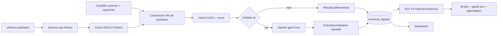

# Audit senior AG2 — Trader_IA

**Date de référence :** 2026-07-26
**Mode :** lecture seule — aucune correction, migration, publication n8n ou écriture métier
**Périmètre prioritaire :** AG2-V3, ses sources de marché, DuckDB, workflows n8n, consommateurs AG1/dashboard et exploitation VPS
**Branche locale observée :** `codex/dashboard-ag1-20260721` (working tree déjà fortement modifié avant l'audit)

## 1. Résumé exécutif

### Verdict

AG2 est **opérationnel mais insuffisamment fiable pour être considéré comme une source autonome de décision financière**. Il reste utilisable comme signal consultatif dans l'architecture actuelle, parce qu'AG1 applique ensuite une matrice, un consensus multi-modèles et des gardes d'exécution. Ces protections aval réduisent le risque sans corriger les défauts intrinsèques d'AG2.

Le risque principal est temporel : AG2 traite des bougies H1 et D1 encore ouvertes comme des observations définitives. Ce comportement est démontré dans le code et dans les données live. Les contrôles ont notamment trouvé 430 lignes Euronext récentes utilisant la bougie D1 du jour pendant la séance, dont 96 directions D1 actionnables et 4 décisions IA `APPROVE`. AG2 ne persiste ni les bougies sources, ni un indicateur `is_closed`, ni une version complète des règles et du modèle ; un signal précis n'est donc pas exactement reproductible a posteriori.

La deuxième faiblesse structurante est la gouvernance opérationnelle : les workflows publiés, les exports du dépôt, les builders et la documentation divergent. Un redéploiement depuis le dépôt ne reproduirait pas l'état live. La quarantaine d'univers combine par ailleurs une actualisation non transactionnelle avec une évaluation de fraîcheur basée sur l'âge mémorisé lors d'anciens calculs. Rejouée au moment de l'audit, cette logique produisait 298 faux positifs de santé sur 361 symboles examinés.

### Comptage des anomalies

| Criticité | Nombre |
|---|---:|
| Critique | 0 |
| Élevée | 10 |
| Moyenne | 7 |
| Faible | 1 |
| **Total** | **18** |

L'absence d'anomalie classée critique ne signifie pas absence de risque financier. Plusieurs anomalies élevées peuvent produire des signaux incorrects dans des conditions réalistes. Leur impact final sur un ordre est toutefois atténué par les contrôles aval d'AG1 et du broker, ce qui ne permet pas de conclure à une décision financière matériellement fausse déjà exécutée.

### Cinq risques principaux

1. Bougies H1/D1 ouvertes utilisées comme clôturées, avec contamination multi-timeframe.
2. Contrôles OHLC insuffisants : des barres impossibles alimentent les indicateurs.
3. Quarantaine techniquement fausse sur la fraîcheur et non atomique lors du reclassement.
4. État live non reproductible depuis le dépôt ; dérive entre variantes Held+Core et Watchlist.
5. Impossibilité de reproduire exactement un signal faute de snapshot source, version de contrat/règles et référence de sortie IA.

### Trois points forts

1. Les calculs représentatifs SMA50, RSI de Wilder, ATR14 et bandes de Bollinger concordent avec un recalcul indépendant sur série valide ; la période de chauffe est explicite.
2. L'univers possède des identifiants internes normalisés, des segments cohérents et une exclusion effective de la quarantaine pour les rotations non détenues.
3. L'exploitation a déjà corrigé des problèmes réels de contention : base défragmentée, maintenance hebdomadaire, timeout runners augmenté et traitements Held/Core séparés des watchlists.

## 2. Périmètre réellement audité

### Faits validés

- Racine : `D:\IA\Trader_IA`.
- Instructions : `AGENTS.md`, README racine, documentation d'architecture, audits et runbooks AG2/AG1/n8n/DuckDB.
- Code AG2 : workflows JSON, builders Python, nœuds Python/JavaScript, schéma SQL et bibliothèques d'indicateurs.
- Amont : `services/yfinance-api`, cache historique monté, enrichissement et table d'univers.
- Aval : lecture AG1 V4, hybridation `ai_decision`/`ai_quality`, dashboard Streamlit.
- État live : métadonnées n8n publiées, dernières exécutions retenues, base DuckDB live en lecture seule, santé broker et approbations en attente.
- Aucun ordre n'a été placé, confirmé ou modifié.

### Éléments examinés sans modification

- Schémas, tailles, cardinalités, contraintes, index, vues et qualité des lignes DuckDB.
- 1 128 fichiers cache OHLCV, soit 764 388 lignes ; sous-ensemble actif et sous-ensemble hors FX.
- Calculs synthétiques représentatifs et cas limites.
- Crons live, versions de code embarquées dans les versions n8n publiées et historique d'exécution disponible.
- Recherche de secrets en clair à haute confiance dans les fichiers suivis par Git.

### Hors périmètre ou non vérifiable exactement

- Rejeu complet historique d'une décision AG2 : les bougies sources exactes et la sortie IA complète ne sont pas persistées.
- Preuve d'un ordre réel erroné causé uniquement par AG2 : AG1 ajoute plusieurs décisions et gardes aval.
- Audit CVE exhaustif en ligne et pentest réseau.
- Restauration effective d'une sauvegarde DuckDB ; aucune restauration n'a été tentée.
- Couverture de tous les jours fériés et calendriers de toutes les places par un oracle externe.
- Tests destructifs de panne, concurrence, reprise ou corruption en production.

## 3. Limites de l'audit

L'état n8n conservé ne couvre qu'environ deux jours d'exécutions détaillées ; les statistiques sur 30 jours proviennent de `run_log` et `technical_signals`. Le working tree comporte de nombreux changements étrangers à l'audit. Les résultats live décrivent un instantané au 2026-07-26 et peuvent évoluer après un nouveau workflow. Les timestamps DuckDB sont dépourvus de timezone native ; leur interprétation repose sur le code et la configuration n8n.

## 4. Architecture actuelle d'AG2

### Composants

| Composant | Rôle réel | État observé |
|---|---|---|
| yfinance-api | Télécharge/cache les historiques H1/D1 non ajustés | Live, bibliothèques non verrouillées strictement |
| AG2 Held+Core | Rotation HELD + CORE, calcul technique, éventuel appel IA | Publié et actif |
| AG2 Watchlist Nightly | Rotation WATCHLIST par lots | Publié et actif |
| Universe Health Quarantine | Audite données/prix et reconstruit les segments automatiques | Publié et actif |
| DuckDB `ag2_v3.duckdb` | Univers, segments, signaux, runs, cache IA, quarantaine | Live, ~17 MiB après défragmentation |
| OpenAI `gpt-5-mini` | Analyse complémentaire de certains signaux | Alias non snapshoté dans les résultats |
| AG1 V4 | Consomme le dernier signal AG2 et applique ses propres gates | Actif ; lecture directe des tables |
| Dashboard | Vue analytique AG2 et pseudo-funnel IA | Actif ; sémantique « actionnable » distincte d'AG1 |

### Chemin d'une donnée



### Déclenchement live vérifié

| Workflow publié | ID | Cron live | Timezone | Statut |
|---|---|---|---|---|
| Technical Held+Core | `AG2V3HELDCORE20260619` | `0 9,13,15 * * 1-5` | Europe/Paris | actif |
| Technical Watchlist Nightly | `AG2V3WATCHNIGHT20260619` | `0 22,2 * * *` | Europe/Paris | actif |
| Universe Health Quarantine | `AG2UHQ20260619` | `0 20 * * 1-5` | Europe/Paris | actif |
| Monolithe historique | `lUsgEdJODpYh5vt0dQdb2` | sans version active | — | inactif |

Les exports locaux annoncent d'autres crons (`10 8,12,14`, `20 2`, `35 18`). La documentation contient encore plusieurs horaires antérieurs. L'état publié est la référence d'exécution observée.

## 5. Cartographie des bases et des flux

### Bases directement ou indirectement utilisées

| Base/source | Producteur | Lecture AG2 | Écriture AG2 | Consommateurs |
|---|---|---:|---:|---|
| `ag2_v3.duckdb` | AG2/UHQ/scripts dédiés | oui | oui | AG1, dashboard, yf-enrichment |
| cache OHLCV yfinance | yfinance-api | oui | non | AG2 |
| `ag1_v4_consensus.duckdb` | AG1 | UHQ, lecture attachée | non | AG1/dashboard |
| base yfinance/enrichissement | yf-enrichment | UHQ, lecture attachée | non | AG1/AG2/UHQ |
| `ag3_v2.duckdb` | AG3 | UHQ, lecture attachée | non | AG1/UHQ |
| SQLite n8n | n8n | métadonnées/exécutions | indirect | exploitation |

### Matrice tables/workflows AG2

| Objet `ag2_v3` | Held+Core | Watchlist | UHQ | AG1/dashboard |
|---|---:|---:|---:|---:|
| `universe` | R/W par upsert | R/W par upsert | R/W | R |
| `universe_segments` | R | R | R/W | R |
| `technical_signals` | R/W | R/W | R | R |
| `run_log` | R/W | R/W | — | diagnostic |
| `batch_state` | R/W | R/W | — | — |
| `ai_cache` | R | R | — | — |
| `universe_quarantine` | R | R | R/W | R |
| `universe_audit_history` | — | — | R/W | diagnostic |
| `universe_audit_runs` | — | — | R/W | diagnostic |

## 6. Inventaire des workflows

| Workflow | Objectif/entrée | Étapes et écritures | Erreurs/retry/idempotence | Risque |
|---|---|---|---|---|
| Held+Core | HELD, CORE_AUTO, CORE_MANUAL ; historique H1/D1 | Init DB → lot → fetch → calcul → hydrate cache → IA conditionnelle → extract → write → finalize | retries HTTP/nœuds ; upserts par symbole ; curseur avancé avant traitement ; `CHECKPOINT` final | Élevé |
| Watchlist | WATCHLIST, lots de 40 | Chaîne similaire, mais version embarquée différente et davantage de `CHECKPOINT` | même limite de reprise ; une exécution `crashed` observée dans la rétention n8n | Élevé |
| UHQ | univers + qualité AG2/yfinance + positions AG1 | attach read-only → audit → quarantine/release → suppression/recréation segments auto → checkpoint | exceptions partiellement converties en résultat `ok:false` ; pas de transaction englobante | Élevé |
| Monolithe legacy | Tous actifs par classe | Ancienne chaîne unique | désactivé ; conservé comme rollback | Moyen, dette/documentation |

### Ordre réel Held+Core/Watchlist

1. Création/altération opportuniste du schéma.
2. Réconciliation des anciens runs `RUNNING` en `STALE` après deux heures.
3. Chargement univers, segments et quarantaine.
4. Sélection du batch et **avance immédiate du pointeur**.
5. Appels historiques H1/D1 par symbole.
6. Calcul des indicateurs, statuts, score et préfiltre.
7. Hydratation éventuelle depuis `ai_cache`.
8. Appel IA si requis.
9. Extraction et garde partielle de cohérence.
10. `INSERT OR REPLACE` du résultat de chaque symbole.
11. Finalisation du run à partir des items reçus, puis `CHECKPOINT` explicite.

Il n'existe pas de transaction couvrant un batch complet. Un résultat partiel est donc visible avant la finalisation.

## 7. Analyse des bases de données

### Moteur, volumétrie et schéma live

- Écrivain n8n : DuckDB 1.4.3 ; lecteur yf-enrichment : 1.4.4.
- Taille au contrôle : 17 838 080 octets, WAL nul, après défragmentation dominicale.
- Cardinalités : `universe` 563 ; `technical_signals` 16 345 ; `run_log` 1 170 ; `ai_cache` 73 ; `batch_state` 6 ; `universe_quarantine` 485 ; `universe_audit_history` 13 850 ; `universe_audit_runs` 30 ; `universe_segments` 362.
- Segments actifs : 50 `CORE_AUTO`, 18 `CORE_MANUAL`, 11 `HELD`, 283 `WATCHLIST`.
- 78 instruments FX historiques restent volontairement sans segment. 124 autres instruments quarantinés sont également hors rotation.

### Structure

Les tables principales disposent de clés primaires. Aucun doublon de clé signal/run-symbole n'a été trouvé. En revanche :

- pas de clés étrangères entre signaux, runs, univers et audits ;
- peu de contraintes `CHECK` sur RSI, OHLC, score, dates et statuts ;
- timestamps `TIMESTAMP` sans timezone ;
- 112 colonnes dans `technical_signals`, mélangeant données, indicateurs, décisions, diagnostic et héritage FX ;
- migrations ad hoc via `CREATE TABLE IF NOT EXISTS` et `ALTER TABLE ADD COLUMN` dans les nœuds ;
- vues live : seulement `v_ag2_fx_output`, alors que le README et `schema.sql` annoncent aussi `v_latest_signals` et `v_ag1_summary` ;
- 70 signaux historiques ne référencent plus un `run_log` existant ;
- `row_hash` est vide sur les 16 345 lignes.

### Modèle financier

Les instruments portent identifiant interne, ticker fournisseur, classe, place et devise dans `universe`. Aucun champ obligatoire vide ni doublon normalisé de ticker n'a été relevé. `yfinance-api` demande `auto_adjust=False`, mais la provenance précise, le statut d'ajustement, la session, le calendrier, le caractère provisoire/clos de chaque barre et la timezone source ne sont pas persistés avec le signal.

La base AG2 ne sépare pas une couche brute immuable d'une couche validée et d'une couche calculée. Les barres ne sont pas conservées dans DuckDB ; seules les dernières valeurs et certains indicateurs le sont. Une correction historique ne permet pas d'identifier automatiquement tous les résultats à recalculer.

### Contrôles quantitatifs

| Contrôle live | Résultat |
|---|---:|
| Signaux avec `h1_date` NULL | 166 |
| Signaux avec `d1_date` NULL | 57 |
| Signaux avec `last_close` NULL | 53 |
| RSI/score/confiance hors bornes | 0 |
| `last_close <= 0` | 0 |
| timestamps futurs détectés dans les signaux | 0 |
| doublons identifiant/run-symbole | 0 |
| orphelins signal → run | 70 |
| symboles dont dernier scan < 24 h | 80/563 |
| symboles dont dernier scan < 96 h | 349/563 |
| symboles dont dernier scan > 10 j | 202/563, majoritairement FX/quarantaine |

### Cache OHLCV

Sur 1 128 fichiers et 764 388 barres :

- H1 : aucun doublon, désordre, prix nul/négatif ou invariant OHLC violé détecté dans l'échantillonnage exhaustif réalisé ;
- D1 : 312 lignes avec au moins un OHLC nul, 962 lignes violant `low <= open/close <= high`, une valeur non positive ;
- hors FX : 204 lignes nulles, 173 violations, une valeur non positive ;
- sur les 359 fichiers disponibles pour les 361 symboles segmentés : 201 lignes nulles et 28 violations OHLC concernant 160 symboles.

Le code ignore une barre si un OHLC est `None`, mais accepte une barre dont le close est hors `[low, high]`. Des exemples actifs ont été observés, sans les reproduire ici au-delà des symboles nécessaires au diagnostic.

### Écritures, concurrence et reprise

- `technical_signals` est écrit par `INSERT OR REPLACE`, symbole par symbole.
- `universe` est réécrit massivement à chaque initialisation de workflow.
- le pointeur de `batch_state` est avancé avant l'achèvement du batch ; une panne saute donc les symboles jusqu'au prochain tour.
- UHQ supprime tous les segments automatiques puis les recrée par insertions individuelles sans transaction globale.
- le `run_id` est basé sur une seconde et un index local ; une collision concurrente reste possible mais n'a pas été démontrée.
- aucun contrôle n8n explicite d'exclusion mutuelle n'a été identifié dans les exports.

## 8. Analyse des workflows

### Divergence dépôt/live

Le workflow Held+Core publié contient la correction de cache récente mais pas le bloc `HELD_FORCED` présent dans le miroir local `nodes/04_compute.py`. Le workflow Watchlist publié embarque encore une autre variante, avec davantage de checkpoints. Les exports JSON, builders et crons locaux ne correspondent pas aux versions actives.

Conséquence : ni un rebuild depuis les nœuds, ni un réimport des exports ne garantit un comportement identique au live. La preuve de revue et le rollback sont fragiles.

### Reprise et état partiel

Sur 30 jours, `run_log` contient 111 runs `SUCCESS` et 18 `STALE`. La durée moyenne des succès est 22,14 minutes, maximum 63,27 minutes. Les comptes annoncés des runs terminés concordent avec les lignes enregistrées, mais un run interrompu n'est pas repris exactement : son curseur est déjà avancé. Les anciens `RUNNING` sont simplement reclassés `STALE` après deux heures.

Dans la rétention n8n récente : six succès Held+Core (moyenne 12,75 min), cinq succès Watchlist (20,66 min) et une exécution Watchlist `crashed`. Les données n8n retenues ne suffisent pas à attribuer cette panne à AG2 seul.

### Gestion des erreurs

Plusieurs helpers d'attachement DuckDB échouent en retournant un ensemble vide. UHQ peut donc poursuivre sans positions AG1, sans qualité yfinance ou sans données AG3. Son `catch` final retourne un objet d'erreur au lieu de nécessairement faire échouer l'exécution n8n. Le `CHECKPOINT` final capture aussi ses erreurs. L'état n8n « success » ne garantit donc pas toujours que toutes les dépendances ou opérations finales ont réussi.

## 9. Risques financiers et temporels

### Bougies ouvertes et multi-timeframe

`yfinance-api` inclut les lignes jusqu'à `now`, fusionne le cache et ne marque pas les bougies closes. `05_snapshot.js` transmet les 60 dernières barres H1 et le contexte D1 sans retirer la barre en formation. AG2 peut donc :

- calculer SMA, RSI, MACD, ATR et bandes sur le H1 courant ;
- considérer le close D1 intraday comme une clôture journalière ;
- utiliser cette pseudo-clôture D1 pour le régime, le score, la résistance et le ratio rendement/risque ;
- transmettre ces valeurs à l'IA.

Preuves live sur 30 jours : 430 lignes Euronext exécutées en journée contenaient la D1 du jour, 96 avaient une direction D1 BUY/SELL, 113 déclenchaient l'IA et 4 étaient `APPROVE`. Des scans US vers 20 h utilisaient aussi des H1 commencées à 19 h 30, donc encore ouvertes.

Il s'agit d'une contamination multi-timeframe, pas d'une utilisation de données futures. Le signal est calculé avec une valeur provisoire qui peut changer avant la clôture et est pourtant stockée comme définitive.

### Indicateurs

Indicateurs identifiés : SMA20/50/200, RSI14 Wilder, MACD 12/26/9, ATR14, Bollinger 20/2, stochastique 14/3, volatilité annualisée, support/résistance, trend strength, volume ratio et score discret.

Sur une série synthétique valide de 260 barres, SMA50, RSI14 Wilder et ATR14 ont concordé exactement avec un calcul indépendant ; la bande supérieure de Bollinger ne différait que de 0,000035 du fait de l'arrondi. La chauffe minimale est de 50 H1 et 200 D1.

Cas limite : toutes les comparaisons de tendance utilisent `>` puis un `else` baissier. Sur une série plate, `close == SMA50`, `SMA50 == SMA200` et `MACD histogram == 0` contribuent donc négativement ; le RSI devient 100 lorsque pertes et gains sont nuls. Le test synthétique produit un signal SELL de score -4 sur un marché parfaitement plat. Un cas live de MACD arrondi à zéro contribuant à un SELL a été retrouvé, mais la prévalence observée reste faible.

### Fraîcheur

AG2 emploie une règle générique UTC/weekday et non les calendriers de chaque place. Le D1 est déclaré `STALE` au-delà d'environ 96 h, mais ce statut n'empêche pas le préfiltre BUY d'utiliser les données D1. AG1 n'invalide le D1 qu'au-delà de 240 h. Trois décisions `APPROVE` associées à un D1 marqué `STALE` ont été trouvées depuis le déploiement hybride, dont deux après le 20 juin.

UHQ évalue la santé des 30 derniers jours avec `data_age_h1_hours` et `data_age_d1_hours` calculés à l'époque du signal. Ces valeurs ne vieillissent jamais. Au moment du contrôle, 311 symboles satisfaisaient la règle historique « au moins deux runs utilisables », contre 13 avec `now - h1_date/d1_date` ; 298 étaient donc de faux positifs potentiels si l'audit était rejoué à cet instant.

### Score, confiance et IA

Le score D1 est une somme discrète de règles non calibrées statistiquement. La confiance technique n'est pas une probabilité. L'IA est soumise à une garde de contradiction et un stop est requis pour `APPROVE`, mais le ratio rendement/risque décrit dans le prompt n'est pas entièrement révalidé de façon déterministe lors de l'extraction.

Les décisions récentes après le 20 juin respectaient le seuil RR attendu dans les données observées ; l'absence de garde stricte est donc classée en risque à vérifier plutôt qu'en anomalie autonome.

## 10. Interfaces avec les autres agents

### AG2 → AG1

AG1 lit directement la dernière ligne de `technical_signals`. Il utilise `ai_decision`/`ai_quality`, bloque un `REJECT` pour une entrée et pondère `APPROVE/WATCH`. Les décisions périmées issues du cache sont aujourd'hui remises à `SKIP` par le nœud live d'hydratation, ce qui est positif.

Faiblesses du contrat :

- pas de version de schéma/message ;
- score sans échelle contractuelle persistée ;
- timestamps sans timezone ;
- aucune propriété `bar_closed` ;
- pas de version persistée de la stratégie, du prompt et du modèle pour chaque résultat ;
- pas de corrélation robuste avec l'exécution n8n ;
- `ai_output_ref` souvent vide ou réduit à une longueur, sans identifiant de réponse ;
- seuils de fraîcheur AG2 et AG1 divergents.

### Dashboard

La vue « Actionnable maintenant » filtre seulement `D1 Action ∈ {BUY, SELL}`. Elle ne reproduit ni le scope AG1, ni la quarantaine, ni l'exclusion FX, ni le blocage `REJECT`, ni toutes les règles de fraîcheur. La capture fournie montre effectivement des FX historiques et des lignes `IA=REJECT` dans les top BUY.

Le funnel agrège par ailleurs la dernière ligne disponible de chaque symbole, dont les dates sont hétérogènes, et non un batch cohérent de 563 analyses. L'étiquette « actionnable » est donc trompeuse ; il s'agit de directions techniques brutes D1.

## 11. Sécurité

### Validé

- Aucun secret en clair à haute confiance n'a été détecté dans les fichiers suivis lors du scan ciblé.
- `.gitignore` exclut les fichiers `.env`, clés SSH et bases DuckDB.
- Les lectures d'audit DuckDB ont utilisé `read_only=True`.
- Les valeurs SQL externes sont majoritairement paramétrées ; les interpolations observées concernent surtout des noms internes de table/colonne.
- Le broker live était sain, authentifié et connecté ; aucune approbation n'était en attente au contrôle. Aucune donnée sensible n'est reproduite ici.

### Risques

- Dépendances yfinance/pandas/FastAPI déclarées avec bornes basses `>=` : l'environnement live a dérivé vers des versions récentes non garanties par un lock.
- Séparation développement/test/production surtout procédurale ; les scripts ont accès aux chemins live si exécutés sur le VPS.
- Aucun scan CVE exhaustif ni test d'exposition réseau n'a été mené dans cet audit non intrusif.

## 12. Performance

### Faits

- Base post-défragmentation : ~17 MiB ; les requêtes analytiques examinées ne sont pas limitées par le volume actuel.
- La défragmentation du 26 juillet a réduit AG2 de 318,8 MiB à 17 MiB, ratio 18,7×, en 6,8 s. Une précédente réduction était de 411,8 MiB à 14 MiB.
- Des `CHECKPOINT` explicites subsistent dans les workflows AG2, malgré l'incident AG3 déjà documenté et la règle projet de ne pas en exécuter dans n8n.
- `universe` est réécrit en masse à chaque run et UHQ effectue de nombreuses écritures unitaires.
- Le cache IA ne contient que 73 entrées, toutes datées de février 2026. Aucun writer actif n'a été trouvé dans la chaîne courante.

Sur 30 jours : 3 122 décisions `FILTERED_OUT`, 518 `NO_CACHE`, 146 `SIGNATURE_CHANGED`, 2 `TTL_EXPIRED`. Environ 666 appels IA étaient donc requis, sans bénéfice réel d'un cache maintenu. Le cache mort augmente coût et latence et complexifie la logique.

### Croissance

`technical_signals` conserve l'historique sans politique de rétention explicitement démontrée. Le volume actuel est faible, mais les checkpoints et upserts massifs créent une amplification d'écriture disproportionnée. La maintenance hebdomadaire masque le symptôme sans supprimer la cause.

## 13. Résilience et observabilité

| Question d'exploitation | Réponse actuelle |
|---|---|
| AG2 fonctionne-t-il ? | Oui, via n8n et `run_log`, mais un succès n'assure pas toutes les dépendances UHQ. |
| Les données sont-elles à jour ? | Partiellement ; 80/563 <24 h, segmentation et quarantaine rendent le dénominateur ambigu. |
| Le dernier run est-il complet ? | Comparaison compte attendu/traité possible pour les runs terminés ; reprise exacte impossible. |
| Pourquoi ce signal ? | Indicateurs et raisons partielles disponibles, mais pas les barres exactes ni la sortie IA complète. |
| Quelles versions l'ont produit ? | Impossible précisément au niveau ligne. |
| Que recalculer après correction ? | Pas de lineage suffisant. |

Points positifs : `run_log`, compteurs attendus/traités, audit UHQ, statuts de fraîcheur et health alert global. Points faibles : pas de corrélation n8n robuste, pas de DLQ, pas de snapshot source, erreurs absorbées, absence d'alerte spécifique sur bougie ouverte/qualité OHLC/cache mort.

Des sauvegardes récentes et des copies `.old` pré-défragmentation ont été observées. Le RPO/RTO et la restauration ne sont pas démontrés.

## 14. Tests et maintenabilité

### Inventaire et exécution

- Aucun test AG2 unitaire, intégration, migration, propriété, reprise, performance ou anti-look-ahead n'a été trouvé.
- Les tests présents dans le dépôt concernent surtout AG1 et le service macro ; ils ne couvrent pas AG2.
- Compilation Python non destructive des builders et bibliothèques AG2 : **réussie**.
- Recalcul indépendant SMA/RSI/ATR/Bollinger sur série synthétique : **réussi sur cas nominal**.
- Cas plat : **échec fonctionnel démontré**, SELL -4.
- Cas OHLC impossible : **accepté à tort** avec statut OK.
- Contrôles SQL quantitatifs et inspection des caches : **exécutés en lecture seule**.

### Maintenabilité

Les nœuds embarquent plusieurs centaines de lignes de Python dans des JSON n8n, parallèlement à des miroirs `.py` et des builders. Ce triplet est difficile à garder synchronisé. Les fonctions d'initialisation mêlent migration, univers, segmentation, scheduling, réconciliation de run et écriture. Le typage est minimal, les contrats ne sont pas versionnés et la configuration est dispersée entre code, JSON, env et documentation.

## 15. Registre complet des anomalies

### AG2-TIME-001 — Bougies ouvertes traitées comme clôturées

- **Catégorie :** temporalité/multi-timeframe — **Criticité : Élevée** — probabilité forte — détectabilité difficile — **P1**.
- **Composants :** `services/yfinance-api/main.py` (normalisation et `/history`), `nodes/05_snapshot.js`, `nodes/04_compute.py`.
- **Preuve :** aucune propriété/filtration de clôture ; 430 D1 Euronext du jour intraday, 96 directions actionnables, 4 `APPROVE`; H1 US courantes observées.
- **Reproduction :** exécuter AG2 pendant une séance puis comparer timestamp de début/fin théorique de la dernière barre à l'heure du run.
- **Impact métier :** indicateurs et RR instables, signal susceptible de disparaître à la clôture.
- **Recommandation :** service de calendrier par instrument, `bar_open_time`, `bar_close_time`, `is_closed`, rejet systématique des barres ouvertes et tests DST/jours fériés.
- **Effort :** élevé ; dépend du contrat yfinance/AG2/AG1.
- **Test :** D1 US à 16 h locale indisponible comme barre close ; H1 exclue jusqu'à sa clôture.

### AG2-DATA-001 — Invariants OHLC non validés

- **Catégorie :** qualité de données — **Élevée** — probabilité forte — détectabilité moyenne — **P1**.
- **Preuve :** 28 violations D1 sur le sous-ensemble segmenté ; le calcul ne vérifie que les valeurs `None`.
- **Impact :** ATR, stochastique, support/résistance et RR incorrects.
- **Recommandation :** couche de validation avec quarantaine de barre, métrique fournisseur et politique explicite de réparation.
- **Effort :** moyen ; dépend du contrat de données.
- **Test :** toute barre violant `low <= min(open,close) <= max(open,close) <= high` est rejetée et tracée.

### AG2-DATA-002 — Fraîcheur UHQ calculée avec un âge historique figé

- **Catégorie :** qualité/quarantaine — **Élevée** — probabilité forte — détectabilité difficile — **P1**.
- **Composant :** `nodes/12_universe_quarantine_audit.py:496`.
- **Preuve :** comparaison `data_age_*` stockée ; 311 sains selon la règle actuelle contre 13 selon l'âge réel, soit 298 faux positifs potentiels au contrôle.
- **Impact :** un actif non rafraîchi peut rester considéré comme techniquement sain.
- **Recommandation :** calculer `current_timestamp - h1_date/d1_date`, selon calendrier de place, dans le run UHQ.
- **Effort :** moyen.
- **Test :** une observation vieille de huit jours, initialement fraîche, ne compte plus comme run sain.

### AG2-WF-001 — Reconstruction des segments non transactionnelle

- **Catégorie :** base/workflow — **Élevée** — probabilité moyenne — détectabilité moyenne — **P1**.
- **Composant :** `nodes/12_universe_quarantine_audit.py:232` et boucle d'insertions.
- **Preuve :** suppression globale des segments auto suivie d'insertions unitaires, sans `BEGIN/COMMIT` englobant.
- **Impact :** crash/lock = univers partiellement segmenté et couverture AG2/AG3 amputée.
- **Recommandation :** construire un snapshot temporaire, valider les cardinalités puis swap atomique transactionnel.
- **Effort :** moyen à élevé.
- **Test :** injection de panne à mi-rebuild ; l'ancien snapshot doit rester intact.

### AG2-WF-002 — Dépendances UHQ en échec fail-open et erreur absorbée

- **Catégorie :** résilience — **Élevée** — probabilité moyenne — détectabilité difficile — **P1**.
- **Composant :** `nodes/12_universe_quarantine_audit.py:176`, `:700`.
- **Preuve :** attachements échoués convertis en jeux vides ; exception finale convertie en résultat.
- **Impact :** positions détenues non reconnues, sélection CORE fausse, exécution n8n possiblement verte malgré audit incomplet.
- **Recommandation :** fail-closed sur les sources indispensables, statut `DEGRADED/FAILED`, aucune mutation si préconditions absentes.
- **Effort :** moyen.
- **Test :** rendre AG1/YF indisponible sur clone ; aucune segmentation ne doit changer et le workflow doit échouer explicitement.

### AG2-WF-003 — Curseur de batch avancé avant commit complet

- **Catégorie :** reprise/idempotence — **Élevée** — probabilité forte — détectabilité moyenne — **P1**.
- **Composant :** `nodes/02_duckdb_init.py:677`.
- **Preuve :** mise à jour `batch_state` avant fetch/calcul ; 18 runs `STALE` sur 30 jours.
- **Impact :** symboles sautés jusqu'au prochain cycle, SLA de fraîcheur dégradé.
- **Recommandation :** lease de batch, état par symbole et avance du checkpoint après succès durable.
- **Effort :** élevé.
- **Test :** interruption après N/40 puis relance ; seuls les 40-N restants sont repris exactement une fois.

### AG2-INT-001 — Seuils de fraîcheur AG2/AG1 incompatibles

- **Catégorie :** contrat inter-agent — **Élevée** — probabilité forte — détectabilité difficile — **P1**.
- **Preuve :** AG2 D1 ~96 h, AG1 240 h ; trois `APPROVE` sur D1 `STALE` observés depuis le déploiement hybride.
- **Impact :** AG1 peut consommer une décision que son producteur juge déjà périmée.
- **Recommandation :** contrat unique de fraîcheur versionné, calcul d'âge réel centralisé et gate explicite.
- **Effort :** moyen ; nécessite parité dashboard/AG1.
- **Test :** matrice de seuils aux bornes 95/96/97/239/240/241 h.

### AG2-REL-001 — État live non reproductible depuis le dépôt

- **Catégorie :** release/configuration — **Élevée** — probabilité forte — détectabilité moyenne — **P1**.
- **Preuve :** crons, compute, checkpoints et hydrate diffèrent entre versions publiées, exports, miroirs et builders.
- **Impact :** rollback ou redéploiement susceptible de changer silencieusement la stratégie.
- **Recommandation :** source canonique unique, génération déterministe, export publié signé et contrôle CI de parité.
- **Effort :** élevé.
- **Test :** export généré byte-equivalent hors métadonnées à la version publiée.

### AG2-AUD-001 — Signal non reproductible et lineage incomplet

- **Catégorie :** auditabilité — **Élevée** — probabilité forte — détectabilité difficile — **P1**.
- **Preuve :** pas de snapshot des barres, `row_hash` vide, versions stratégie/prompt/modèle non persistées, `ai_output_ref` absent ou réduit à une longueur.
- **Impact :** impossible d'expliquer/rejouer exactement une recommandation ou cibler un recalcul.
- **Recommandation :** manifeste immutable par signal : hashes données/règles/prompt, modèle snapshoté, réponse ID, timestamps UTC, lineage.
- **Effort :** élevé.
- **Test :** replay offline d'un signal donnant le même résultat déterministe et le même manifeste.

### AG2-TEST-001 — Absence de suite de tests AG2

- **Catégorie :** validation — **Élevée** — probabilité forte — détectabilité facile — **P1**.
- **Preuve :** aucun test AG2 trouvé ; anomalies temporelles et cas plat non couverts.
- **Impact :** régressions financières possibles lors d'une modification de nœud/builder.
- **Recommandation :** pyramide de tests décrite en section 20, fixtures multi-marchés et golden datasets.
- **Effort :** élevé mais incrémental.
- **Test :** CI obligatoire sur code canonique et workflow généré.

### AG2-PERF-001 — Checkpoints et amplification d'écriture

- **Catégorie :** performance/fiabilité — **Moyenne** — probabilité forte — détectabilité facile — **P2**.
- **Preuve :** `CHECKPOINT` encore présent ; défragmentation 318,8 → 17 MiB, ratio 18,7× ; upsert massif de l'univers.
- **Impact :** locks, durée, mémoire, risque de timeout/OOM déjà connu sur architecture voisine.
- **Recommandation :** retirer les checkpoints des nœuds, réduire les writes, conserver maintenance offline mesurée.
- **Effort :** moyen.
- **Test :** shadow longue durée, taille/WAL/latence et contention comparées.

### AG2-AI-001 — Cache IA inactif

- **Catégorie :** coût/performance — **Moyenne** — probabilité forte — détectabilité facile — **P2**.
- **Preuve :** 73 entrées, toutes de février ; aucun writer actif ; 518 `NO_CACHE` et 146 signatures changées sur 30 jours.
- **Impact :** appels répétés, coût et latence ; branche morte trompeuse.
- **Recommandation :** restaurer un cache versionné et sûr ou supprimer explicitement le mécanisme.
- **Effort :** moyen.
- **Test :** second run identique sans appel réseau, sauf politique d'expiration documentée.

### AG2-FIN-001 — Égalité assimilée à un signal baissier

- **Catégorie :** logique financière — **Moyenne** — probabilité moyenne — détectabilité moyenne — **P2**.
- **Composant :** `nodes/04_compute.py:327`.
- **Preuve :** série plate → RSI 100 et SELL -4 ; comparaisons `>`/`else`.
- **Impact :** faux SELL sur actifs plats ou valeurs arrondies.
- **Recommandation :** branche neutre avec epsilon et convention RSI flat explicite.
- **Effort :** faible.
- **Test :** série constante, égalités exactes et perturbations ±epsilon.

### AG2-UI-001 — « Actionnable maintenant » ne représente pas le scope tradable

- **Catégorie :** interface/exploitation — **Moyenne** — probabilité forte — détectabilité facile — **P2**.
- **Composant :** `services/dashboard/app.py:3149`, `:17550`.
- **Preuve :** filtre limité à BUY/SELL ; capture avec FX et `REJECT`.
- **Impact :** opérateur induit en erreur, métriques IA/funnel mal interprétées.
- **Recommandation :** renommer en directions brutes ou reproduire explicitement scope/gates AG1 avec provenance.
- **Effort :** moyen ; parité obligatoire avec `SYSTEM_LINKS_AND_PARITY.md`.
- **Test :** FX, quarantaine, stale et REJECT exclus d'une vue réellement « actionnable ».

### AG2-DB-001 — Gouvernance de schéma insuffisante

- **Catégorie :** base/maintenabilité — **Moyenne** — probabilité forte — détectabilité moyenne — **P2**.
- **Preuve :** DDL opportuniste, vues annoncées absentes, 70 orphelins, pas de FK/CHECK, 112 colonnes mixtes.
- **Impact :** dérive silencieuse et contrats implicites.
- **Recommandation :** migrations versionnées, dictionnaire de données, contraintes adaptées et vues sous test.
- **Effort :** élevé.
- **Test :** migration sur copie de chaque version supportée et vérification intégrité/vues.

### AG2-OBS-001 — Succès technique et succès métier insuffisamment distingués

- **Catégorie :** observabilité — **Moyenne** — probabilité moyenne — détectabilité difficile — **P2**.
- **Preuve :** erreurs/checkpoints absorbés, pas de corrélation n8n persistée, `STALE` auto-réconcilié sans reprise.
- **Impact :** diagnostic lent, résultat partiel interprété comme complet.
- **Recommandation :** statuts structurés, invariants de fin, correlation ID et alertes dédiées.
- **Effort :** moyen.
- **Test :** matrice de fault injection ; chaque panne donne un état et une alerte non ambigus.

### AG2-DEP-001 — Dépendances amont non reproductibles

- **Catégorie :** supply chain/maintenabilité — **Moyenne** — probabilité moyenne — détectabilité facile — **P2**.
- **Composant :** `services/yfinance-api/requirements.txt`.
- **Preuve :** contraintes `>=`; live yfinance 1.3.0, pandas 3.0.2, FastAPI 0.136.1 sans lock démontré.
- **Impact :** modification silencieuse du format, timezone ou comportement de marché.
- **Recommandation :** lock avec hashes, image immuable, procédure de montée et tests contractuels.
- **Effort :** faible à moyen.
- **Test :** build reproductible et golden responses `/history`.

### AG2-FIN-002 — Annualisation H1 fixe pour tous les marchés

- **Catégorie :** calibration — **Faible** — probabilité forte — détectabilité facile — **P3**.
- **Composant :** `nodes/04_compute.py:274`.
- **Preuve :** facteur `sqrt(252*8)` identique pour toutes les places/actifs.
- **Impact :** volatilité peu comparable entre sessions, crypto et marchés asiatiques.
- **Recommandation :** horizon annualisé documenté par classe/session ou métrique non annualisée.
- **Effort :** faible à moyen.
- **Test :** fixtures 24/7, 6,5 h et 8 h avec valeurs attendues.

## 16. Risques à vérifier

| Risque non confirmé | Pourquoi non confirmé | Vérification proposée |
|---|---|---|
| Collision de `run_id` en concurrence | aucune collision trouvée | shadow avec deux démarrages dans la même seconde |
| RR IA accepté hors règle | anciennes anomalies pré-fix, aucune après le 20 juin | replay de réponses adversariales sur extracteur |
| Ajustements splits/dividendes incohérents | `auto_adjust=False`, mais contrat fournisseur incomplet | golden set autour de corporate actions |
| Restauration/RPO insuffisants | sauvegardes présentes, restore non testé | exercice sur environnement isolé |
| Vulnérabilités CVE | pas de scan réseau/deps exhaustif | SBOM + scanner approuvé |
| Exposition réseau excessive | configuration partiellement inspectée | revue firewall/Traefik/VPS dédiée |
| Impact final des bougies ouvertes sur des ordres exécutés | lineage AG2→décision→ordre incomplet | corrélation future par manifestes et replay |

## 17. Points positifs

- Whitelist d'actifs AG1 et segmentation explicite empêchent les 78 FX legacy d'entrer dans les rotations AG2/AG3.
- Positions détenues séparées des watchlists ; fréquence plus élevée pour Held+Core.
- Quarantaine, audit history et audit runs offrent une base utile à renforcer.
- Data age réel a déjà été corrigé côté AG1/dashboard, preuve d'une bonne prise en compte du problème en aval.
- Safe reset des caches IA périmés/REJECT présent dans les versions live observées.
- Paramétrage `auto_adjust=False` explicite, tri et déduplication des barres en amont.
- PK et unicité de base satisfaisantes ; aucune duplication de signal détectée.
- Défragmentation offline rapide et documentée, avec copies pré-opération.
- Broker et gardes live restent indépendants d'AG2 ; l'audit n'a touché aucun garde d'exécution.

## 18. Quick wins

Sans les appliquer pendant cet audit :

1. Renommer immédiatement la vue dashboard en « directions D1 brutes » tant que les gates ne sont pas alignées.
2. Ajouter des tests purs pour série plate, OHLC impossible, barre ouverte et seuils 96/240 h.
3. Rendre visibles dans les rapports les versions publiées n8n et leur hash par rapport au dépôt.
4. Émettre une alerte si `is_closed` est inconnu, avant tout travail plus large de calendrier.
5. Désigner une source canonique de workflow et interdire en CI les divergences JSON/mirrors/builders.
6. Documenter le cache IA comme inactif ou mesurer précisément sa remise en service.

## 19. Plan de remédiation priorisé

### Phase 0 — maîtrise du risque

- Geler toute évolution des règles AG2 hors correction auditée.
- Capturer/hash les workflows publiés et établir la source canonique.
- Clarifier dans le dashboard que les directions brutes ne sont pas des opportunités tradables.

### Phase 1 — exactitude financière

- Introduire contrat de barre close + calendriers multi-places.
- Valider OHLCV avant calcul.
- Unifier fraîcheur AG2/UHQ/AG1/dashboard.
- Corriger les égalités/flat series avec tests de référence.

### Phase 2 — atomicité et reprise

- Rendre UHQ transactionnel et fail-closed.
- Mettre en place leases/checkpoints après commit et reprise par symbole.
- Retirer checkpoints n8n et réduire write amplification.

### Phase 3 — auditabilité et industrialisation

- Versionner schema/contrats/règles/prompts/modèles.
- Persister manifestes et snapshots/hashes nécessaires au replay.
- Restaurer ou supprimer le cache IA.
- Verrouiller les dépendances et tester la restauration.

Le backlog détaillé est dans `AUDIT_AG2_ACTIONS.md`.

## 20. Stratégie de tests de non-régression

### Niveau 1 — fonctions pures

- Golden vectors SMA/EMA/RSI/MACD/ATR/Bollinger/stochastique.
- Séries plate, monotone, oscillante, courte, trous, NaN, prix nul et OHLC impossible.
- Propriétés : RSI ∈ [0,100], ATR ≥ 0, invariants de neutralité avec epsilon.

### Niveau 2 — temporalité

- Horloges figées par place : Paris, New York, Tokyo, Hong Kong, crypto 24/7.
- DST désynchronisé Europe/US, jours fériés, demi-séances.
- D1 en milieu de séance et H1 à la 59e minute toujours exclues.
- As-of joins : aucune donnée postérieure à l'instant décisionnel.

### Niveau 3 — base et contrats

- Migrations sur copies de chaque schéma connu.
- Contraintes, idempotence, double retry et absence d'orphelins.
- Contrat AG2→AG1 versionné, tests aux bornes de fraîcheur.
- Recréation et compatibilité des vues.

### Niveau 4 — workflows

- Génération déterministe du JSON n8n.
- Fault injection après chaque étape : lock DB, timeout API, réponse IA invalide, crash mi-batch.
- Reprise exacte sans perte ni doublon.
- UHQ : swap atomique et aucune mutation lorsque les dépendances manquent.

### Niveau 5 — shadow/replay

- Replay sur snapshot isolé, jamais sur production.
- Comparaison ancienne/nouvelle stratégie avec attribution des écarts.
- Shadow pendant plusieurs séances et places avant publication.
- Vérification parité AG1/dashboard et blast-radius documenté.

## 21. Décisions d'architecture à arbitrer

1. **Barres :** conserver uniquement des barres closes ou autoriser explicitement un signal intrabar distinct et révisable ?
2. **Source canonique :** code Python générateur, JSON n8n exporté ou workflow-as-code externe ?
3. **Stockage :** persister les barres validées dans DuckDB avec lineage, ou référencer un data lake immutable ?
4. **IA :** rôle de l'IA dans AG2, cache/versionnement et degré de déterminisme attendu.
5. **Fraîcheur :** service central de calendrier/âge ou règles dupliquées mais contractuellement testées ?
6. **Historique :** politique de rétention, recalcul et invalidation après correction fournisseur.
7. **UHQ :** table snapshot versionnée avec swap atomique ou calcul de segments dérivé à la lecture.
8. **Dashboard :** vue descriptive AG2 séparée d'une vue réellement tradable AG1.

## 22. Conclusion sur l'aptitude aux conditions réelles

### Faits validés

AG2 tourne, produit des résultats, alimente AG1 et possède plusieurs contrôles utiles. Les calculs nominaux représentatifs sont corrects et les données structurelles d'univers sont globalement propres. Les protections aval sont substantielles.

### Hypothèse prudente

AG2 peut continuer à contribuer comme **une entrée consultative non exclusive** tant que le consensus AG1 et les gardes broker restent intacts. L'audit ne recommande ni de relâcher ces gardes ni de considérer AG2 comme un moteur autonome.

### Actions restantes avant confiance renforcée

Les anomalies P1 doivent être corrigées, rejouées sur données isolées puis validées en shadow. Les prérequis minimaux sont : barres closes, validation OHLCV, fraîcheur cohérente, UHQ atomique/fail-closed, reprise exacte, source workflow canonique et lineage suffisant. Toute correction nécessite une autorisation distincte ; aucune n'a été réalisée ici.

## Annexe A — Requêtes d'audit non destructives

Les requêtes ont été exécutées avec une connexion DuckDB `read_only=True`. Extraits reproductibles :

```sql
-- Cardinalités
SELECT table_name, estimated_size
FROM duckdb_tables()
ORDER BY table_name;

-- Dernière couverture par symbole
WITH latest AS (
  SELECT symbol_internal, max(workflow_date) AS last_scan
  FROM technical_signals GROUP BY 1
)
SELECT
  count(*) AS symbols,
  count(*) FILTER (WHERE last_scan >= current_timestamp - INTERVAL 24 HOUR) AS within_24h,
  count(*) FILTER (WHERE last_scan >= current_timestamp - INTERVAL 96 HOUR) AS within_96h
FROM latest;

-- Violations et nulls de résultat
SELECT
  count(*) FILTER (WHERE h1_date IS NULL) AS h1_date_null,
  count(*) FILTER (WHERE d1_date IS NULL) AS d1_date_null,
  count(*) FILTER (WHERE last_close IS NULL) AS close_null,
  count(*) FILTER (WHERE last_close <= 0) AS close_nonpositive
FROM technical_signals;

-- Orphelins de run
SELECT count(*)
FROM technical_signals s
LEFT JOIN run_log r USING (run_id)
WHERE r.run_id IS NULL;

-- Santé UHQ : âge stocké contre âge réel au moment du contrôle
WITH recent AS (
  SELECT symbol_internal,
    CASE WHEN h1_status='OK' AND d1_status='OK'
      AND coalesce(data_age_h1_hours,1e9)<=72
      AND coalesce(data_age_d1_hours,1e9)<=240 THEN 1 ELSE 0 END stored_ok,
    CASE WHEN h1_status='OK' AND d1_status='OK'
      AND date_diff('hour',h1_date,current_timestamp)<=72
      AND date_diff('hour',d1_date,current_timestamp)<=240 THEN 1 ELSE 0 END real_ok
  FROM technical_signals
  WHERE workflow_date >= current_timestamp - INTERVAL 30 DAY
), agg AS (
  SELECT symbol_internal, sum(stored_ok) s, sum(real_ok) r
  FROM recent GROUP BY 1
)
SELECT
  count(*) FILTER (WHERE s>=2) AS stored_healthy,
  count(*) FILTER (WHERE r>=2) AS real_healthy,
  count(*) FILTER (WHERE s>=2 AND r<2) AS false_healthy
FROM agg;
```

## Annexe B — Références principales inspectées

- `AGENTS.md`
- `docs/architecture/etat_des_lieux.md`
- `docs/operations/SYSTEM_LINKS_AND_PARITY.md`
- `docs/operations/SCHEDULING_AND_LOAD.md`
- `docs/audits/20260619_ag2_v3_analyse_pertinence_efficience.md`
- `docs/operations/20260619_ag2_split_rotation_deploy_notes.md`
- `docs/operations/20260624_ag2_held_core_duckdb_hardening.md`
- `docs/operations/20260705_ag3_checkpoint_defrag_fix.md`
- `agents/trading-actions/AG2 - La technique/AG2-V3/`
- `services/yfinance-api/main.py`
- `services/dashboard/app.py`
- workflow AG1 V4 et nœud R8 de préparation matrice
