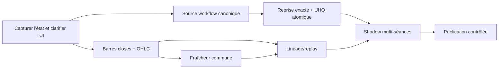

# Backlog de remédiation AG2

Ce backlog découle de l'audit du 2026-07-26. La remédiation close-only est mise
en œuvre dans la branche courante ; son déploiement et ses preuves sont consignés
dans `docs/operations/20260726_ag2_closed_bars_remediation.md`.

État de cette livraison : ACT-P0-01/02, P1-01/02/03/04/05/07/08/09/10,
P2-01/02/03/05/07/08 et P3-01 sont traitées. ACT-P1-06 est partiellement traité
(curseur après commit, mais pas encore de lease distribué par symbole) et
ACT-P1-10 dispose des tests hors production mais pas encore du contrôle CI
obligatoire. Les sujets P2-04/06 et P3-02/03/04 restent des chantiers distincts,
sans relâchement des gardes live.

## P0 — mesure conservatoire

| ID | Anomalie | Action | Composants | Prérequis | Effort | Risque régression | Critères d'acceptation | Tests requis |
|---|---|---|---|---|---|---|---|---|
| ACT-P0-01 | AG2-REL-001 | Capturer les versions n8n publiées, calculer leurs hashes et désigner explicitement la source canonique sans republier | workflows AG2, builders, procédure release | fenêtre de lecture live ; choix d'architecture | S | faible | inventaire signé, mapping publié↔repo complet, aucune mutation live | comparaison structurelle JSON |
| ACT-P0-02 | AG2-UI-001 | Renommer la vue « Actionnable maintenant » en « Directions D1 brutes » et expliciter les exclusions non appliquées | dashboard | autorisation UI ; lecture `SYSTEM_LINKS_AND_PARITY.md` | S | faible | aucune promesse de tradabilité ; FX/REJECT clairement identifiés comme non-actionnables | smoke UI + snapshot |

## P1 — exactitude financière et fiabilité

| ID | Anomalie | Action | Composants | Prérequis | Effort | Risque régression | Critères d'acceptation | Tests requis |
|---|---|---|---|---|---|---|---|---|
| ACT-P1-01 | AG2-TIME-001 | Définir un contrat de barre avec place, timezone, ouverture, clôture et `is_closed`; exclure les barres ouvertes | yfinance-api, AG2 fetch/snapshot/compute, schéma | décision intrabar vs close-only ; calendriers | L | élevé | aucun D1 intraday considéré clos ; aucune H1 avant fin de fenêtre | Paris/NY/Tokyo/HK/crypto, DST, jours fériés, demi-séance |
| ACT-P1-02 | AG2-DATA-001 | Ajouter une validation OHLCV centralisée et une quarantaine de barre avant indicateurs | yfinance-api ou couche data canonique, métriques AG2 | politique rejeter/réparer | M | moyen | invariant OHLC garanti ; anomalies tracées par source | null, négatif, high/low inversés, volume invalide |
| ACT-P1-03 | AG2-DATA-002 | Remplacer l'âge UHQ stocké par l'âge réel as-of audit, tenant compte du calendrier | UHQ, contrat temporalité | ACT-P1-01 | M | moyen | une observation ancienne ne reste pas saine ; dénominateurs explicites | fixture vieille de 8 j, week-end, jour férié |
| ACT-P1-04 | AG2-WF-001 | Refaire les segments via snapshot temporaire validé puis swap transactionnel | UHQ, DuckDB | copie DB et test version 1.4.3 | M/L | élevé | crash à toute étape laisse l'ancien snapshot intact | fault injection à 0/25/50/99 % |
| ACT-P1-05 | AG2-WF-002 | Rendre AG1/YF et autres préconditions critiques fail-closed ; propager un échec n8n explicite | UHQ | classification dépendances obligatoires/facultatives | M | moyen | aucune mutation si source critique absente ; alerte unique et claire | DB attach absent, lock, schéma incompatible |
| ACT-P1-06 | AG2-WF-003 | Introduire lease/checkpoint après commit et état durable par symbole | init, batch_state, finalize, run_log | modèle de reprise et concurrence | L | élevé | reprise exacte, ni saut ni doublon, pointeur avancé après succès | kill après chaque étape, double déclenchement |
| ACT-P1-07 | AG2-INT-001 | Centraliser/versionner les seuils de fraîcheur AG2→AG1→dashboard | AG2, AG1 R8, dashboard | revue `SYSTEM_LINKS_AND_PARITY.md` | M | élevé | mêmes résultats aux bornes dans les trois composants | 72/96/168/240 h ±epsilon |
| ACT-P1-08 | AG2-REL-001 | Transformer les workflows en artefacts générés déterministement depuis une source canonique | nodes, builders, JSON, CI, runbook | ACT-P0-01 | L | élevé | build local reproduit le publié ; diff bloquant en CI | golden workflow + import shadow |
| ACT-P1-09 | AG2-AUD-001 | Persister manifeste de signal : data hash, règles, prompt, modèle snapshot, réponse/ref IA, correlation ID | schéma, compute, extract, AG1 | politique rétention/sensibilité | L | moyen/élevé | un signal peut être expliqué et rejoué ; aucun secret stocké | replay exact déterministe + lineage correction historique |
| ACT-P1-10 | AG2-TEST-001 | Créer le socle de tests AG2 et une CI sans accès production | package AG2, fixtures, CI | code canonique testable | L | faible | tests purs et workflows critiques obligatoires avant merge | indicateurs, temporalité, DB, reprise, contrats |

## P2 — performance, contrat et exploitation

| ID | Anomalie | Action | Composants | Prérequis | Effort | Risque régression | Critères d'acceptation | Tests requis |
|---|---|---|---|---|---|---|---|---|
| ACT-P2-01 | AG2-PERF-001 | Retirer les `CHECKPOINT` des nœuds, réduire les upserts invariants et mesurer l'amplification | init/finalize/UHQ, scripts maintenance | shadow sur copie fragmentée | M | moyen | aucun checkpoint online ; taille et latence stables une semaine | benchmark A/B, locks, RSS, WAL, défrag |
| ACT-P2-02 | AG2-AI-001 | Décider cache IA versionné ou suppression ; implémenter une seule voie | hydrate/extract/schema | politique TTL/signature et sécurité REJECT | M | moyen | cache observable, hit rate réel ou zéro code mort | hit/miss/TTL/signature/REJECT périmé |
| ACT-P2-03 | AG2-FIN-001 | Ajouter neutralité avec epsilon et convention RSI série plate | indicators/compute | validation métier du score | S | moyen | série plate NEUTRAL, aucun biais directionnel d'égalité | flat, near-flat, arrondis |
| ACT-P2-04 | AG2-UI-001 | Construire séparément une vue « scope AG1 » reproduisant toutes les gates et leur provenance | dashboard + AG1 | ACT-P1-07 ; parité obligatoire | M | élevé | chaque exclusion explique la gate ; métriques sur snapshot cohérent | parité calculée sur golden DB |
| ACT-P2-05 | AG2-DB-001 | Introduire migrations versionnées, dictionnaire et contraintes ; traiter vues/orphelins | schema, migration runner, docs | sauvegarde/restauration testée | L | élevé | version schema explicite ; migrations idempotentes ; vues sous test | upgrade depuis copies historiques, rollback logique |
| ACT-P2-06 | AG2-OBS-001 | Ajouter statuts métier structurés, correlation ID, invariants de fin et alertes | n8n, run_log, monitoring | schéma contrat | M | moyen | SUCCESS seulement si préconditions et compteurs validés | fault matrix, alerte et dashboard ops |
| ACT-P2-07 | AG2-DEP-001 | Verrouiller dépendances et image avec hashes/SBOM | yfinance-api, CI/build | fenêtre de validation fournisseurs | S/M | moyen | deux builds identiques ; upgrade volontaire et testée | golden `/history`, contract tests, scan CVE |
| ACT-P2-08 | Risque RR | Réappliquer en code les gardes RR/stop annoncées dans le prompt | extract IA | décision métier sur seuils | S/M | moyen | aucune réponse IA ne contourne les invariants déterministes | réponses adversariales, valeurs nulles/extrêmes |

## P3 — calibration et gouvernance

| ID | Anomalie | Action | Composants | Prérequis | Effort | Risque régression | Critères d'acceptation | Tests requis |
|---|---|---|---|---|---|---|---|---|
| ACT-P3-01 | AG2-FIN-002 | Revoir l'annualisation par classe/session ou publier la volatilité non annualisée | compute, contrat AG1 | arbitrage métier | S/M | moyen | unité et hypothèses documentées ; comparabilité assumée | marchés 24/7, 6,5 h, 8 h |
| ACT-P3-02 | Risque sauvegarde | Formaliser RPO/RTO et tester une restauration isolée | opérations DuckDB | stockage isolé | M | faible | restauration chronométrée, intégrité vérifiée, runbook à jour | drill restore + checksums |
| ACT-P3-03 | Risque sécurité | Produire SBOM, scan CVE et revue exposition réseau/permissions | images, VPS, CI | outils approuvés | M | faible | constats tracés sans secrets ; exceptions acceptées | scan dépendances/image/config |
| ACT-P3-04 | Risque corporate actions | Construire un golden set splits/dividendes et formaliser ajusté/non ajusté | yfinance-api, data contract | sélection d'instruments historiques | M | moyen | comportement stable autour d'opérations sur titres | split, dividende, changement ticker |

## Ordonnancement recommandé

## Definition of done globale

Une remédiation AG2 ne devrait être considérée terminée que si :

1. le code canonique, l'artefact n8n généré et la version publiée sont corrélés par hash ;
2. les tests unitaires, temporalité, contrats, migration et fault injection passent ;
3. le replay sur snapshot isolé explique chaque différence ;
4. le shadow couvre plusieurs séances et places sans écrire dans les tables live ;
5. la parité AG1/dashboard est démontrée ;
6. un rollback documenté et testé existe ;
7. aucune garde d'exécution live n'est relâchée.
